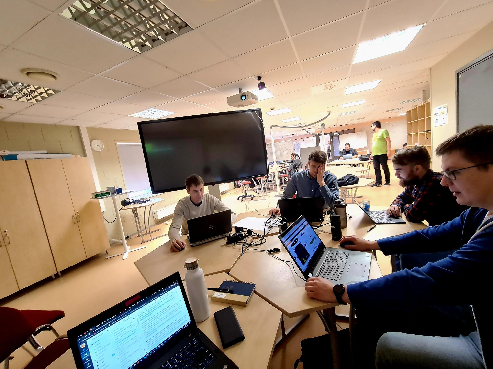
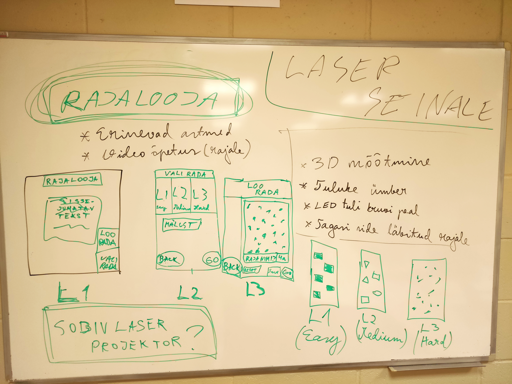
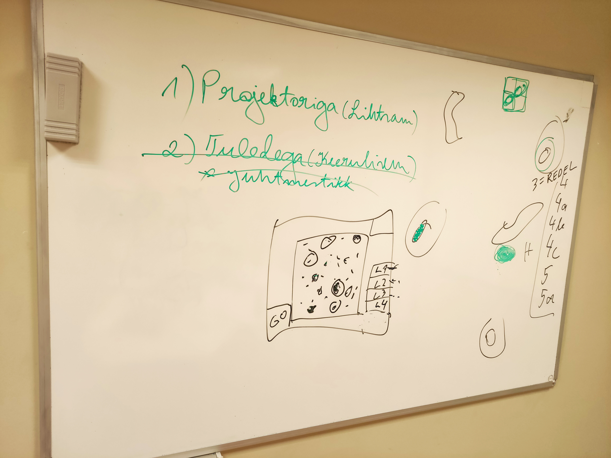

># RAJALOOJA
## TEAM
- Oliver Õunaid
- Riivo Matt
- Ragnar Lall
- Tanel Põldma
- Kevin Kruuser
- Kairi Laidmaa

***

## PROJEKTI EESMÄRK

🧗

## Eesmärk on jõuda reaalse tooteni, mis aitab arendada eesti ronimist ja ronijaid nii laste kui täiskasvanute tasemel. Asendades kallid lahendused lihtsa ja odavama alternatiiviga.

 
 

##  TÖÖVAHENDID

 Suhtluskanal: Teams 

 Wireframe: Figma

 Google 

# Prototüüp tahvlil

 

 

### LOGO

.png)

## FIGMA WIREFRAME

[FIGMA](https://www.figma.com/file/MdoGS7gNFriuYr2DFZI0VB/Ronimine?node-id=0%3A1&t=IYwif8de2gi2zHQJ-0)

---
---

## Eneseanalüüs
1. Kuidas rakendad selles projektis õpitut järgmistes arendusprojektides

2. Üks pehme oskus, mida õppisin ja endas arendasin

3. Üks tehniline oskus, mida õppisin ja endas arendasin

 

- Oliver Õunaid
1.  
2.  
3. 
- Riivo Matt
1. Tehnilise dokumentatsiooni otsimine.
2. Meeskonnatöö, suhtlemine.
3. Figma, Powerpoint
- Ragnar Lall
1. Luua esialgu läbimõeldud visuaalne plaan
2. Tiimitöö
3. Figma
- Tanel Põldma
1. Rakendan kogemust
2. Meeskonnatöö jaotus
3. Figma
- Kevin Kruuser
1. Seda kuidas teha tiimis tööd
2. Suhtlust tiimis ja tööde jaotust
3. Figmat õppisin kasutama
- Kairi Laidmaa
1. Disaini lahendused
2. Töö meeskonnas
3. Figma

